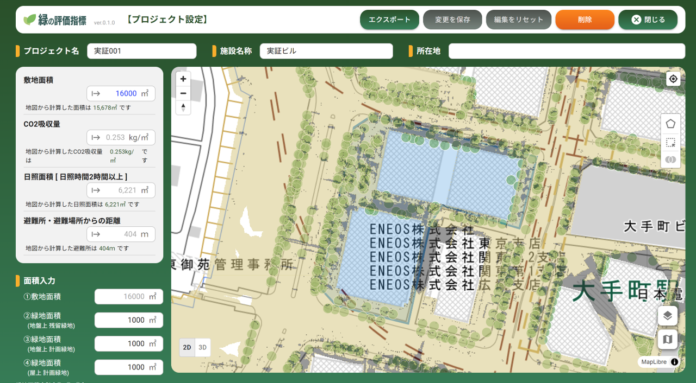

# 緑の評価指標機能

## 更新履歴
| 更新日時     | リリース       | 更新内容                                       |
|-------------|--------------|----------------------------------------------|
| 2026/3/19  | 1st Release  | 初版リリース |

## 1. 概要 
本リポジトリでは、2025年度のProject PLATEAUで開発した「緑の評価指標機能」のソースコードを公開しています。

本システムは、3D都市モデルを活用した樹木管理機能及び緑の効果の定量的評価を支援する取り組みである「樹木データを活用した温熱環境シミュレータの開発」の一部として開発されたWebアプリケーションです。

## 2. 「緑の評価指標機能」について 
「緑の評価指標機能」は優良緑地確保計画認定制度(TSUNAG)など国の制度との連携を想定し、緑化の評価指標を算出し、指定したエリア内での緑地面積の自動算出機能や日陰シミュレーションの可視化、登録された緑地データに基づくCO₂吸収量の算出機能などを提供します。

本システムの詳細については[技術検証レポート](https://www.mlit.go.jp/plateau/file/libraries/doc/plateau_tech_doc_0136_ver01.pdf)を参照してください。

## 3. 利用手順 
本システムの構築手順及び利用手順については[利用チュートリアル](https://project-plateau.github.io/green-indicator)を参照してください。

## 4. システム概要
#### ①敷地面積、ＣＯ２吸収量、日影図等の面積算出および表示
- 予め登録した樹木データや日影図等などから、TSUNAG申請等の規定の計算式に基づき、選択した敷地範囲のCO2吸収量、日影面積などを算出し表示します。

#### ②算出結果のエクスポート
- 算出した結果をExcel形式でエクスポートします。

## 5. 利用技術

| 種別            | 名称                                                     | バージョン          | 内容                                      |
| ------------- | ------------------------------------------------------ | -------------- | --------------------------------------- |
| オープンソースソフトウェア | [Apache HTTP Server](https://httpd.apache.org/)        | 2.4.58         | Webアプリで配信を行うためのWebサーバーソフトウェア            |
|               | [PostGIS](https://github.com/postgis/postgis)          | 3.4.1          | PostgreSQLで位置情報を扱うことを可能とする拡張機能          |
| オープンソースライブラリ  | [CesiumJS](https://github.com/CesiumGS/cesium)         | 1.115          | 3Dビューワ上にデータを描画するためのライブラリ                |
|               | [React.js](https://github.com/facebook/react/releases) | 18.2.0         | JavaScriptのフレームワーク内で機能するUIを構築するためのライブラリ |
| オープンソースRDBMS  | [PostgreSQL](https://github.com/postgres/postgres)     | 16.2           | 各種配信するデータを格納するリレーショナルデータベース             |
| 商用ソフトウェア      | [Cesium ion](https://cesium.com/platform/cesium-ion/)  | -              | 3Dデータの変換と配信のクラウドサービス                    |
| 商用ライブラリ       | [AG Grid](https://ag-grid.com/)                        | 31.1.1         | JavaScriptで集計、フィルタリング等を行うためのライブラリ       |
| クラウドサービス      | [Firebase](https://firebase.google.com/)               | -              | 認証機能を提供するクラウドサービス         |

## 6. 動作環境 
| 項目               | 最小動作環境                                                                                                                                                                                                                                                                                                                                    | 推奨動作環境                   | 
| ------------------ | ----------------------------------------------------------------------------------------------------------------------------------------------------------------------------------------------------------------------------------------------------------------------------------------------------------------------------------------------- | ------------------------------ | 
| OS                 | Microsoft Windows 10 以上　または macOS 12 Monterey 以上                                                                                                                                                                                                                                                                                                                  |  同左 | 
| CPU                | Pentium 4 以上                                                                                                                                                                                                                                                                                                                               | 同左              | 
| メモリ             | 8GB以上                                                                                                                                                                                                                                                                                                                                         | 同左                        |                  | 

## 7. 本リポジトリのフォルダ構成 
| フォルダ名                              | 詳細                   |
| ---------------------------------- | -------------------- |
| img                                | スクリーンショット    |
| public                  | 公開用静的ファイル     |
| public/favicon.png      | favicon画像     |
| src                     | アプリケーションソース   |
| src/App.jsx             | ルートコンポーネント    |
| src/main.jsx            | エントリーポイント     |
| src/main.css            | 全体スタイル        |
| src/core.jsx            | アプリコア処理       |
| src/dispatcher.js       | イベント管理        |
| src/error.jsx           | エラー表示UI       |
| src/assets              | 画像等アセット       |
| src/components          | 共通UIコンポーネント   |
| src/components/cesium   | Cesium関連UI    |
| src/components/mapbox   | Mapbox描画UI    |
| src/manager             | API通信・ユーティリティ |
| src/map                 | 地図描画処理        |
| src/map/cesium          | Cesiumレイヤ処理   |
| src/map/mapbox          | Mapboxレイヤ処理   |
| src/map/styles          | 地図スタイル定義      |
| src/resources           | 静的リソース        |
| src/resources/fonts     | フォント          |
| src/resources/map_style | MapスタイルJSON   |
| src/views               | 画面UI          |
| src/views/auth.jsx      | 認証画面          |
| src/views/login.jsx     | ログイン画面        |
| src/views/header.jsx    | ヘッダーUI        |
| src/views/loading.jsx   | ローディングUI      |
| src/views/main          | メイン画面UI       |
| src/views/project       | プロジェクト画面群     |
| src/views/project/map   | 地図表示UI        |
| index.html              | HTMLテンプレート    |
| package.json            | 依存ライブラリ定義     |
| package-lock.json       | 依存固定定義        |
| eslint.config.js        | Lint設定        |
| vite.config.js          | Vite設定        |
| tsconfig.json           | TypeScript設定  |
| tsconfig.node.json      | Node用TS設定     |

## 8. ライセンス

- ソースコード及び関連ドキュメントの著作権は国土交通省に帰属します。
- 本ドキュメントは[Project PLATEAUのサイトポリシー](https://www.mlit.go.jp/plateau/site-policy/)（CCBY4.0及び政府標準利用規約2.0）に従い提供されています。

## 9. 注意事項 

- 本リポジトリは参考資料として提供しているものです。動作保証は行っていません。
- 本リポジトリについては予告なく変更又は削除をする可能性があります。
- 本リポジトリの利用により生じた損失及び損害等について、国土交通省はいかなる責任も負わないものとします。

## 10. 参考資料
- 技術検証レポート: https://www.mlit.go.jp/plateau/file/libraries/doc/plateau_tech_doc_0136_ver01.pdf
- PLATEAU WebサイトのUse caseページ「樹木データを活用した温熱環境シミュレータの開発」: https://www.mlit.go.jp/plateau/use-case/uc25-11/
