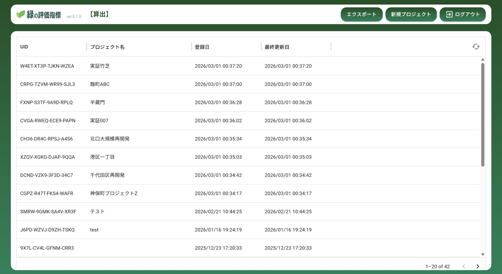
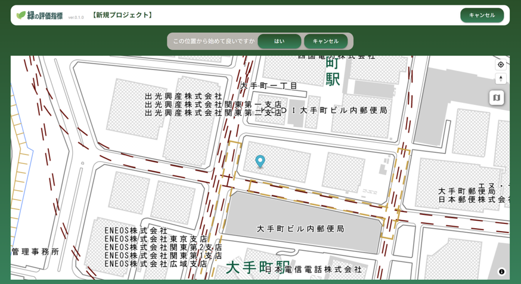

# 操作マニュアル

# 1 本書について

本書では、緑の評価指標機能（以下「本システム」という。）の操作手順について記載しています。

# 2 使い方

## 2-1 ログイン画面

本システムをデプロイしたURLにアクセスすると以下の画面が表示されます。設定したログインID（メールアドレス）、パスワードを入力することでシステムのメイン（樹木管理）画面が表示されます。

## 2-2 プロジェクト一覧画面

① 新規プロジェクト登録

・登録したプロジェクト一覧が表示されます

・左上「新規プロジェクト登録」から、緑の評価指標を算出する対象エリアを登録します

## 2-3 対象エリア登録画面

① 対象エリア登録

・地図上でプロジェクトの対象エリアのおおよその位置をクリックして、エリア登録を行います

## 2-4 敷地選択、指標算出画面

① プロジェクト基本情報入力

・プロジェクト名称、ビル名称、住所を入力します

② 敷地選択

・地図の矩形選択ボタンを押し、地図上で範囲をクリックし対象エリアを選択します

③ 指標算出

・選択したエリアの敷地面積、CO2吸収量、日影図、避難所・避難場所からの距離を自動算出します

④ 緑地面積等の登録

・緑化完了報告書等に記載の緑地面積等を手動で入力します

⑤ 保存およびエクスポート

・保存ボタンで登録内容を保存します

・保存後にエクスポートボタンが表示されます。算出結果をExcel形式でエクスポートします

⑥ 2D/3D切替

・地図の左下にある 2D/3Dボタンで2D/3D表示を切り替えることができます

